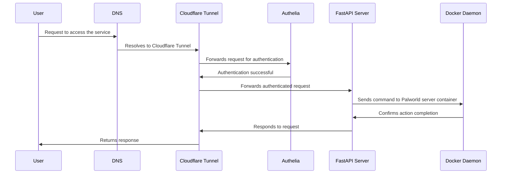

# Bestpals

A Python FastAPI app intended to be used with https://github.com/jammsen/docker-palworld-dedicated-server for allowing requests to start/stop a server on-demand.


### Test:
```
docker build -t bestpals:test --target test .
docker run -it --rm -v "$(pwd)/out:/out" --name bestpalstest bestpals:test
```

### Build:
```
docker build -t bestpals:latest --target artifact .
```

### Sonarqube Scan:
```
#run your tests first to generate coverage and test result files, then run this docker command to scan

docker run -it --rm -e SONAR_HOST_URL="http://host.docker.internal:9000" -e SONAR_LOGIN="<your-generated-token>" -v "$(pwd):/usr/src" sonarsource/sonar-scanner-cli
```

### Trivy Scan:
```
docker run -it --rm -v /var/run/docker.sock:/var/run/docker.sock -v "$(pwd)/out:/out" aquasec/trivy image --format table --output /out/trivy-report.txt --scanners vuln bestpals:latest
```

### Run:
```
docker run -it --rm -p 8000:8000 -v /var/run/docker.sock:/var/run/docker.sock --name bestpals bestpals:latest
```

### Update to palworld docker-compose.yml:
* Be sure to update your default.env file. The docker-compose.yml file in this repository has been updated to use palworld.env, which is a gitignored file with updated *ADMIN_PASSWORD* and *SERVER_PASSWORD* settings.
```
version: '3.9'
services:
  palworld-dedicated-server:
    container_name: palworld-dedicated-server
    image: jammsen/palworld-dedicated-server:latest
    restart: unless-stopped
    ports:
      - target: 8211
        published: 8211
        protocol: udp
        mode: host
      - target: 25575
        published: 25575
        protocol: tcp
        mode: host
    env_file:
      - ./default.env
    volumes:
      - ./game:/palworld

  fastapi-app:
    container_name: fastapi-app
    build:
      context: .
      dockerfile: Dockerfile.fastapi  # Update this line if your Dockerfile has a different name
    ports:
      - "8000:8000"
    volumes:
      - /var/run/docker.sock:/var/run/docker.sock  # Mount the Docker socket
    environment:
      - DOCKER_HOST=unix:///var/run/docker.sock
```

## A diagram of a possible stack, and the flow for requests.


## TODO:
- because palworld has known memory leak, have a timed backup/broadcast/restart sequence.
